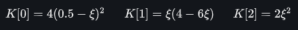

# Symbolic_B-Spline
This repository contains the code that returns the B-Spline basis functions in symbolic/equation format. This helps in getting some new perspectives about B-Splines, also helps the beginners to get feel of Isogeometric analysis by doing manual calculations with these basis functions, and Helps in making manual notes and teaching B-Splines. 

It is possible to convert these basis functions equation to latex commands and use in thesis or research papers.

#### Requirements & Dependencies:

In order to try this code, It is necessary to install the Anaconda(Jupyter Notebook). The dependent libraries (NUMPY and SYMPY) are integral packages of it, so no need to install them separately.

### How to Use:

To demonstrate the working of the  code, degree 2, B-Spline with knot vector {0,0,0,0.5,1,1,1} is considered. B-spline with these properties has 2 parametric spans (elements in FEM/IGA terminology) first one in the range {0,0.5} and other in {0.5,1}. In each element has 3 (degree+1) basis functions 

#### 	Jupyter Version:

##### To get basis functions of Element 1:

```python
# Defining the inputs
p = 2
knot = [0,0,0,0.5,1,1,1]
xi = symp.Symbol('xi')
elem = 1
# Calling the function with parameter and storing basis equations 
k  = bspline_elem_basis(p, knt, xi, el)
```



##### To get basis functions of Element 2: 

```python
p = 2
knot = [0,0,0,0.5,1,1,1]
xi = symp.Symbol('xi')
elem = 2
k  = bspline_elem_basis(p, knt, xi, el)
```


