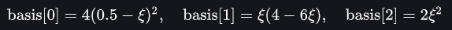
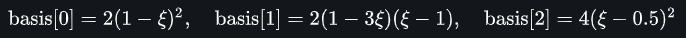

# Symbolic_B-Spline
This repository contains the code that returns the B-Spline basis functions in symbolic/equation format. This helps in getting some new perspectives about B-Splines, also helps the beginners to get feel of Isogeometric analysis by doing manual calculations with these basis functions, and Helps in making manual notes and teaching B-Splines. 

It is possible to generate the latex commands of the basis functions using this and those can be used in writing your thesis or research papers.

### Requirements & Dependencies:

In order to try this code, Install the Anaconda(Jupyter Notebook). The dependent libraries (NUMPY and SYMPY) are integral packages of it, so no need to install them separately.

### How to Use:

To demonstrate the working of the  code, degree 2, B-Spline with knot vector {0,0,0,0.5,1,1,1} is considered. B-spline with these properties has 2 parametric spans (elements in FEM/IGA terminology) first one in the range {0,0.5} and other in {0.5,1}. In each element has 3 (degree+1) basis functions.

```python
# Defining the inputs
p = 2						# Degree
knot = [0,0,0,0.5,1,1,1]	# Knot vector
xi = symp.Symbol('xi')		# Symbolic variable
simplify = True				# Simplied expression of the basis functions.
# simplify = False 			# For expanded format of the basis functions.
```

#### To get basis functions of Element 1, span {0,0.5}:

```python
elem = 1 # Element 1
basis  = bspline_elem_basis(p, knot, xi, elem)
```



#### To get basis functions of Element 2, span {0..5,1}: 

```python
elem = 2 # Element 2
basis  = bspline_elem_basis(p, knt, xi, el)  
```



#### Converting Expressions into LATEX format:

```python
print(sympy.latex(basis)) # Prints the latex format of all the basis functions.
# OR
print(sympy.latex(basis[0])) # To get latex format of any one of the basis function.
```

This procedure is applied for any other degree and knot vector. 

Hope this tool helps you in studying and developing deeper understanding of B-spline and other related topics like NURBS, Isogeometric analysis. 

Please, give a star to this repository, if you like it. Raise an issue, if you would like to see any new feature need to be added. Thank you. 

